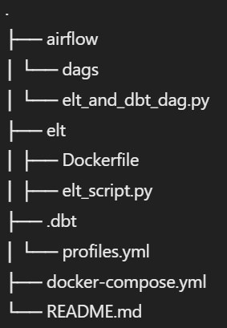
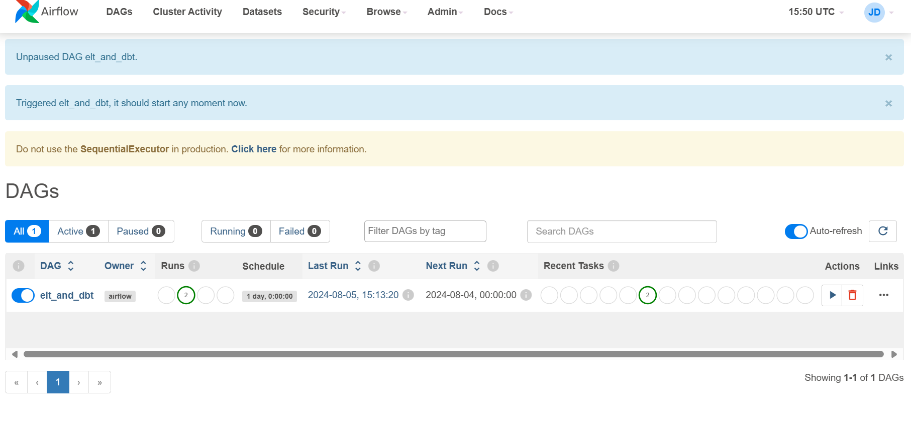
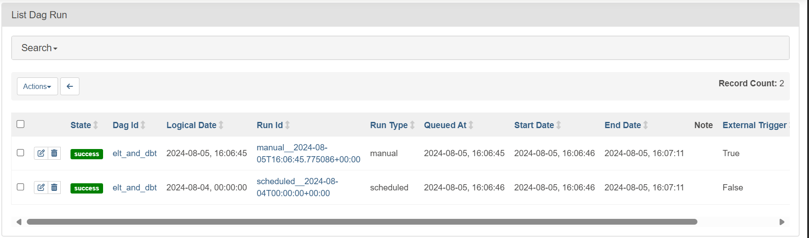
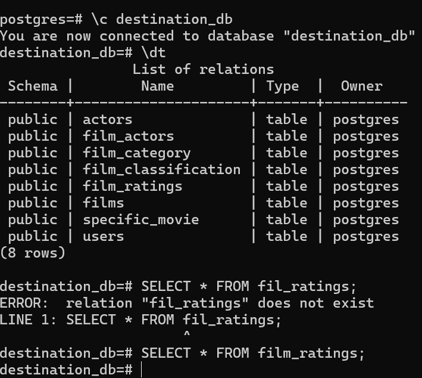
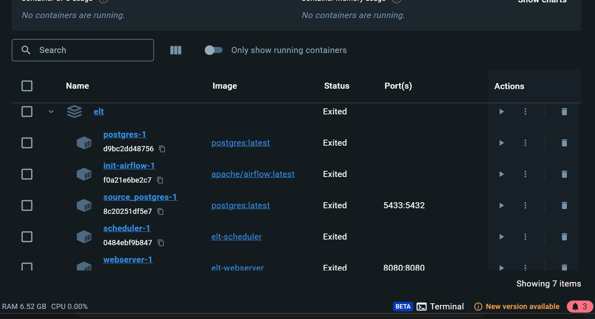

# Data Engineering Project: ELT Workflow with Airflow and dbt

This project demonstrates an ELT (Extract, Load, Transform) workflow using Airflow for orchestration and dbt for data transformations. The workflow includes the following components:

1. Source PostgreSQL database
2. Destination PostgreSQL database
3. Airflow for orchestration

***## Project Structure***





- **airflow/dags/elt_and_dbt_dag.py**: Defines the Airflow DAG for the ELT workflow.
- **elt/Dockerfile**: Dockerfile for building the ELT environment.
- **elt/elt_script.py**: Python script for extracting and loading data between PostgreSQL databases.
- **.dbt/profiles.yml**: Configuration file for dbt.
- **docker-compose.yml**: Docker Compose file for setting up the environment.
- **README.md**: Project documentation.

***## Setup Instructions***

### Prerequisites

- Docker
- Docker Compose

### Step-by-Step Setup

1. **Clone the Repository**

    ```bash
    git clone https://github.com/sanath-tejas-474/data-engineering.git
    cd data-engineering
    ```

2. **Start the Docker Containers**

    ```bash
    docker-compose up -d
    ```

3. **Initialize the Airflow Database and Create Admin User**

    This is handled by the `init-airflow` service in the `docker-compose.yml` file. The user can access the Airflow UI at `http://localhost:8080` with the credentials:
    - Username: airflow
    - Password: password

4. **Configure dbt Profiles**

    Ensure that the `.dbt/profiles.yml` file is correctly configured to point to your PostgreSQL databases.

5. **Run the Airflow DAG**

    Access the Airflow UI at `http://localhost:8080` and trigger the `elt_and_dbt` DAG to start the ELT workflow.

***## Workflow Explanation***

### Airflow DAG

The Airflow DAG (`elt_and_dbt_dag.py`) consists of two main tasks:

1. **run_elt_script**: A Python task that runs the `elt_script.py` to extract data from the source PostgreSQL database and load it into the destination PostgreSQL database.
2. **dbt_run**: A DockerOperator task that runs dbt inside a Docker container to perform data transformations.

### ELT Script

The `elt_script.py` script performs the following steps:

1. **Wait for PostgreSQL to become available**: The script checks if the PostgreSQL service is ready to accept connections.
2. **Dump the source database**: Using `pg_dump`, the script creates a SQL dump of the source PostgreSQL database.
3. **Load the dump into the destination database**: Using `psql`, the script loads the SQL dump into the destination PostgreSQL database.

### Docker Compose

The `docker-compose.yml` file defines the services for the project:

- **source_postgres**: The source PostgreSQL database.
- **destination_postgres**: The destination PostgreSQL database.
- **init-airflow**: A service to initialize the Airflow database and create an admin user.
- **webserver**: The Airflow webserver.
- **scheduler**: The Airflow scheduler.

***## Screenshots***

1. **Airflow DAG View**

    

2. **Airflow Task Logs**

    

3. **PostgreSQL Databases**

    

4. **Docker Containers**

    

***## Conclusion***

This project showcases a robust ELT pipeline using Airflow for orchestration and dbt for data transformation. By leveraging Docker, the setup ensures a consistent and isolated environment, making the workflow reproducible and scalable.
